# User Interface
The ToAutomate UI is located in the Properties(Press N) Panel of the 3D-View.

## Side Panel
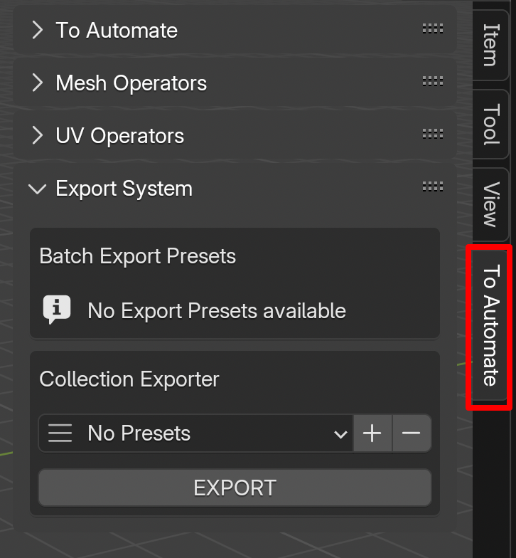  
Located in the Properties Panel of 3D View, Tap `To Automate` to get started and you'll see following tool menus.

## 3D Object Tools
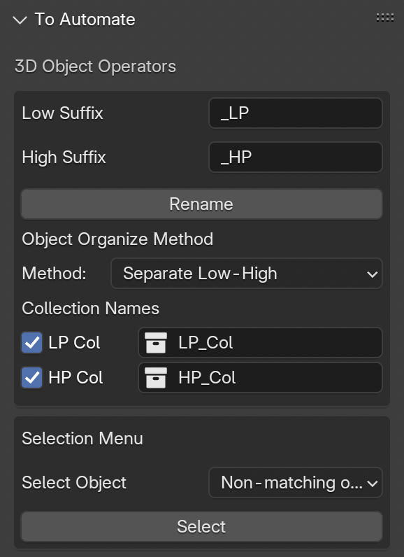 
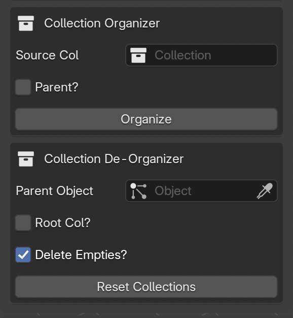  

1. **Rename**: Select Two Object and press `Rename`, It Renames the active Object and add '_LP' suffix to it and '_HP' suffix to the other selected object
    1. Rename Operator requires two selected object to make a Low-High Object named Pair
    1. On Press of Rename, the active Object (named "Cube") get renamed to Cube + "_LP" (`Low Suffix`) and second selected object get renamed Cube + "_HP" (High Suffix)
    2. Resulting name of active_object becomes from "Cube" to "Cube_LP" 
        and for `second` selected object "Cube_HP",  High_name = Low_object_name + high_suffix

2. **Object Organize Method**
    1. Method to Organize:  
        1. 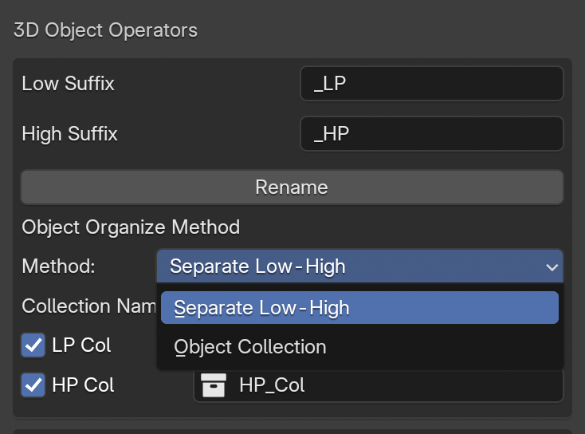  
        1. `OP1`: **Separate Low-High**:  When pressed Rename, Moves the Low and High suffix objects to the individual `Low_Col` and `High_Col` Collections respectively.  Toggle the `Check` in front of LP Col and HP Col to disable moving to collection.
        2. `OP2` : **Object Collection**: When pressed Rename, Moves both the Low and High suffixed objects to a new `Object's name` Collection.   **Example:** Resulting `"Cube_LP"` and `"Cube_HP"` Objects will both be in Collection `"Cube"`.

3. **Selection Menu**: 
     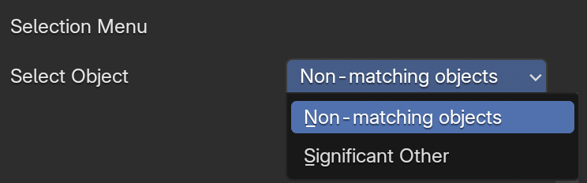  
    1. `OP1` , **`Non-matching Object`**: To Check if an object's counterpart (Low or high) exists.
    2. `OP2` , **`Significant Other`**: To Check if any object doesn't have it's Counterpart (Low or high) and select them. 
    3. **`Note`**: Works with respect to defined/named LP Col and HP Col in Organize Method  

 
4. **Collection Organizer**: Converts the Blender's Collection Heirarchy to Empty object-parent collection for the collection tree, Helpful when want to preserve heirarchy for .fbx or other 3D softwares. 
    1. `Source Col`: Select a Source Collection to Convert to Empty-object Parent heirarchy. 
    2. `Parent`: Toggle Parent if we want an external Empty-Object that will go on top of the Final src Collection object. 
        3. `Name`: Give a name for the External Parent Object, If doesn't exist, will create it 
    3. `Organize`: Press Organize and convert your Collection Heirarchy into empty-parent heirarchy 

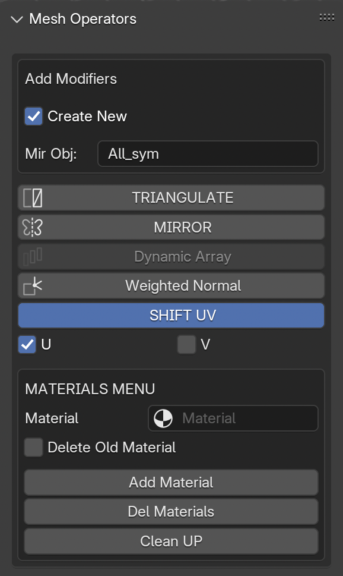 
## Mesh Menu
1. **Modifiers**:
    1. Overview: Applies the following Modifiers to all selected objects.
    1. `Create New`: If the object already have selected modifier, It'll create an additional new modifier. Helpful when need multiple Mirror Modifiers.
    2. `TRIANGULATE`: Apply to all objects, keeps mesh clean to edit and prepared for export and baking.  
    Adds a triangulate modifier, with `keep normals` toggled `On` (Helpful in keeping normals consistent).
    3. `MIRROR`: Adds a Mirror Modifier to selected object, with some additional properties as a pop up menu.
        1. Opens an Additional Dialogue menu to select the Mirror Origin (A symmetry Object in world center). Or to Select axis for the mirror.
        2. Applies to all selected objects
    4. `Dynamic Array`: It's not normal array, it needs two objects specifically. What it does basically is: 
        1. `Requirements`: The active object and a second selected object
        2. Dynamic Array calculates the 3D Distance between both objects and adds an array to active object that makes it's Array distance to the calculated distance above.
        3. `Weighted Normal`: Adds Weighted Normal to all the selected objects.
        4. `SHIFT UV`: Helpful for Mirrors and Arrays, When in game object baking, having mirror for each object, can result in Overlap UVs, so enable SHIFT_UV, and select U or V or both to shift the Mirrored-part's UV out of 1:1 to avoid overlap in main baking region.
2. **Materials**
    1. `Material`: Select a Material from Scene
    2. `Delete Old Material`: Toggle ON to remove old materials of an object, when adding material from below.
    3. `Add Material`: Adds selected Material in `Material` to all selected objects.
        1. If no `Material` was selected, a pop-up will come up that asks for a name for the New Material to add to the objects.
    4. `Del Materials`: Deletes all Materials of all selected Objects. Everything
    5. `Clean UP`: Removes Unused Materials from selected Objects.

## UV Menu
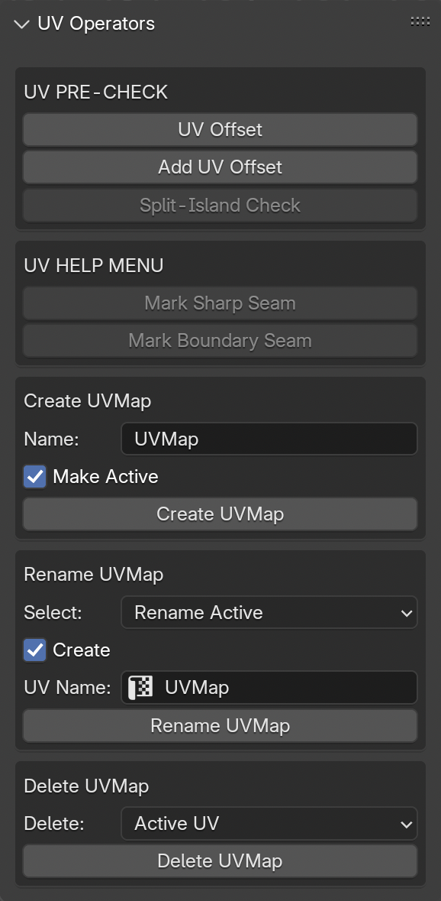  

1. **UV PRE-CHECK**: Precheck UV Offset for all selected objects
    1. Precheck helps to Check `UV Offset` value in Modifiers of Object. Specifically `Array` and `Mirror's` UV Offset.
        1. If an object's modifier has both U and V are 0. It could lead to UV overlap, so the object is selected.
    2. `Add UV Offset` Adds UV Offset to U or V, for the modifiers in an object (`Array` and `Mirror`).
    3. Split-Island Check is a wip operator, that helps select islands that are split in UV Map, let's say an island had 3 or 4. faces, but somehow accidentally, we moved one island separate, this could lead to some little bug in UV. So it selects those parts in the UV. Helpful to open a UV-Editor tab on right of 3D-View.
2. **UV HELP MENU**: Helps in some quick setting Seam operations
    1. `Mark Sharp Seam`: Marks sharp edges of an object to seams.
    2. `Mark Boundary Seams`: Of the selected faces, the overall boundaries will be marked as seam.

3. **Create UVMap**: Create UVMap for all selected objects
    1. `Name`: Name for the UVMap
    2. `Make Active`: Toggle `ON` or `OFF`: If `ON`, makes the UVMap of the name as active.
    3. `Create UVMap`: Createas a UVMap to all selected objects of the given name, if already exists in an object, Makes it active( Considering `Make Active` is `ON`)
 
4. **Rename UVMap**: Renames the UVMap, Select Option for renaming method.
    1. Rename Option:
        1. `Rename Active`: Renames the active UVMap of selected object(s).
        2. `Find and Rename`: Finds UVMap of provided `find` name and renames it as `replace` name.
            1. `Find Name`: Find name to search in the UVMap list.
    2. `UV Name`: UVMap Name for the final UVMap.
    3. `Rename UVMap`: Operator to do the rename action.
5. **Delete UVMap**: Deletes the UVMap, Selection option for Deleting Method:
    1. Delete Option: 
        1. `Active UV`: Deletes the Active UVMap of the selected object(s).
        2. `UV Named as`: Deletes the UVMap with the given name in the name field.
    2. `Delete UVMap`: Operator to delete the UVMap(s).

## Collection Export Menu
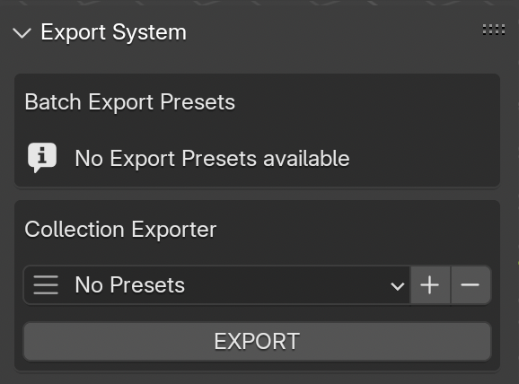
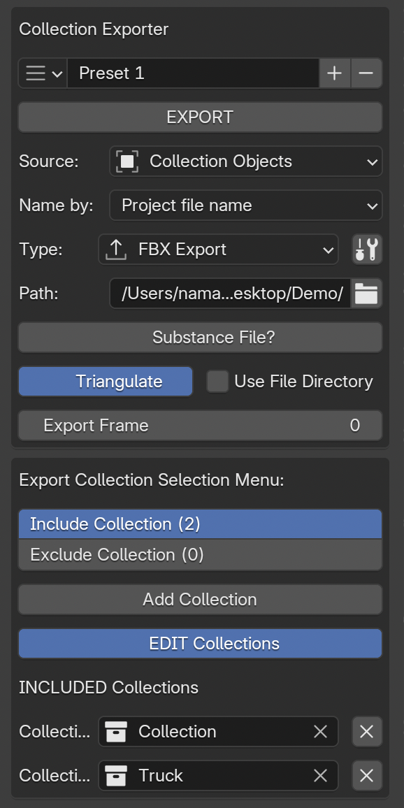

## **Export Menu**
1. **Preset Menu Overview**: 
    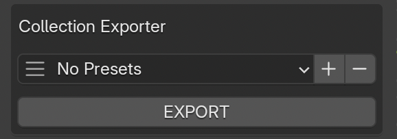 
    1. `Preset`: Select the Preset from the Presets Menu.
    2. `Name Field`: Set the name of current preset. Default: `Preset + count`
    2. `Export`: If a Preset is selected, Exports the resulting file. `(Read below for more details)`
    3. **`+`**: `ADD`: Adds a new preset for Export.
    4. **`-`**: `REMOVE`: Deletes the active preset of Export menu
2. **Preset Properties**: 
    1. **`Source:`**: Select Source for the objects/Collections to export 
        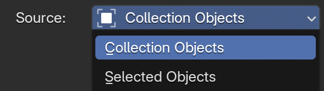 
        1. `Collection Objects`: Export the Collection Objects, select Collection in Export Collection Selection Menu.
        2. `Selected Objects`: Exports the selected objects.
    2. **`File Name`**: Options for name of the Export file. 
        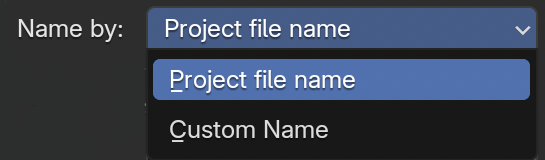 
        1. `Project File name`: Export the resulting file as `Blend_file_name.fbx`, Condition being Blend file must be saved in a directory.
        2. `Custom File Name`: Brings out a name field for the export file name.
            1. `File Name`: Provide the file name for the export file. (Don't leave empty) 
        
    3. **`File Type`**:Option to select the file extensions or format of file. `(Currently 4 below as primary type used, todo: rest)`  
             
        1. `FBX Export`: Makes the final export file as 'My_object.fbx'
        2. `OBJ Export`: Makes the final export file as 'My_object.obj'
        3. `USDz Export`: Makes the final export file as 'My_object.usd*'
        4. `DAE Export`: Makes the final export file as 'My_object.dae'

    4.  **`File Settings`**: **`WRENCH ICON`** : Select the settings button on right of file type to set custom settings for export file for current preset
        1. Can also load from user-defined presets for each file format in preferences. 
        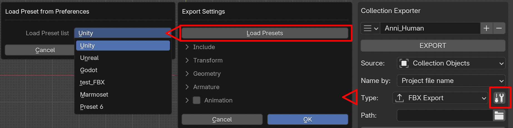 

    
    5. **`Path`**: Export Path for file, click the folder button to select a directory to export file in, or type the directory in field yourself.
    6. **`Substance File?`**: Click to Toggle `ON` or `OFF`: 
        1. If `OFF`: No Extra files apart from mesh file.
        2. If `ON`: Creates a Substance Project with the mesh file.
            1. `Substance Menu`:
                1. `Diff Name`: If ON: asks for a name for Substance File, Else, uses the object file name above.
                2. `Spp Path`: File Path for Substance file to be saved in.
                3. `Tex Path`: Textures Export Path for Substance File.
    7. **`Use File Directory`**: Saves the file in the File Directory instead of external path provided.
    8. **`Export Frame`**: Default 0, if changed to let's 10. The final objects/collections will be exported at that timeline frame, Helpful if needed objects at specified frame maybe cuz of required Translation of objects at that frame.

3. **Export Collection Selection**: Select Collection(s) to include/exclude in export file when `Collection Objects` is selected in Export Type. 
**`Note:`** Make sure Source is set to **`Collection Objects`** 
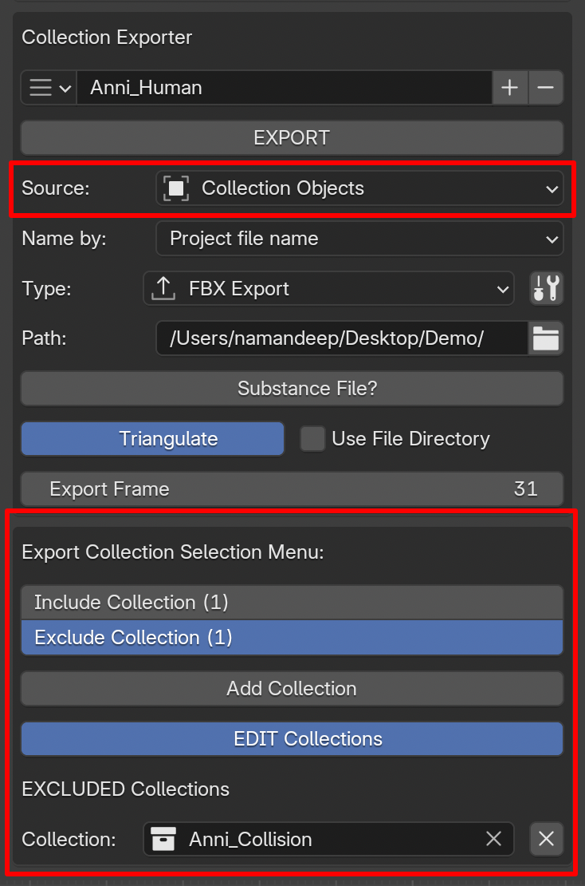
    1. Toggle `Include Collection`: Toggle the collection selection that needs to be included in the final export collections
    2. Toggle `Exclude Collection`: Toggles the Collection selection that needs to be excluded in the final export Collections.
        1. Example: We include a top collection named `Parent`, which has 5 child collections, but we only want to export only 4 collections, There are two methods, either select all 4 childen in Include collection, Or  
        Select the unwanted collection in the Exclude Collection, the resulting collection will be free of excluded collections.
    3. `Add Collection`: Adds the selection Collection (in the outliner) to list of either `Included Collections` or `Excluded Collections` whichever option is selected.
        1. `Note`: Add any top-level collection to include and all it's sub-collections or sub-sub collections ... all collections will be exported.
        2. `Note 2`: If wants to exclude some children or sub collection, select exclude collection and from the Collection tree, it will excluded when Exporting Collection Heirarchy.

    4. `EDIT Collections`: Toggle `ON` to edit Collections list or `OFF` to avoid removing any collection by mistake.
    5. `INCLUDED Collections` or `EXCLUDED Collections`:
        1. Shows the Collection select Menu for Appropriate type of `Collection`
        2. Add Collections here.

