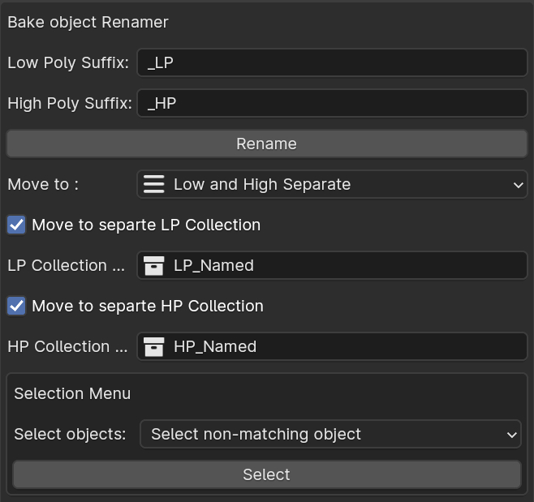

# Object Scene Operator

### Faster Renaming and Organizing Low & High Poly Objects Appropriately

<!--  -->

#### Properties:
1. `LP_Suffix`: Set suffix that will be added to the Low Poly Object
2. `HP_Suffix`: Set suffix that will be added to the High Poly Object
3. `LP Collection`: Set name for the Low poly collection to hold LP Objects
4. `HP Collection`: Set name for the Low poly collection to hold HP Objects
5. `Rename`: Rename Button to rename and `(if enabled)` move to Low / High Collections respectively.

#### Usage:
1. Select two objects `active_object` and `second_object`, when the algorithm runs, it will rename the `active_object` and add LP suffix to it. And adds the HP suffix to the non-active object.
2. If you have toggled the `Move to Collection` property to `ON`. It will move the respective object with the respective name to the respective Collection.
3. For example, if you had LP prefix as `_LP`, and HP prefix as `_HP`, and name will become: `my_obj_name__LP` and `my_obj_name_HP` for HP, and they will be moved to the `LP` and `HP` Collection respectively.

### Selection Menu
**Requirements**: Works with the collections and Suffix of the Rename operators. Like LP & HP suffix and LP & HP Collection Names.

#### Options

1. `Select non-matching object`: Search for objects that doesn't have matching counterparts in the opposite collection. Like finding if no HP object of `abc_LP`   
2. `Select significant other`: Selects the HP object of selected LP objects or vice versa. Helpful when needed to select counter object of selected objects.

#### Usage
1. Select any number of object with either `LP` or `HP` prefix or both, then press `Select` what it does is, checks for the `non-matching` or `significant other` in the counter collections `LP_Collection/HP_Collection`. If found it selects the objects and make them active.

### Collection Organizer

Collection Organizer helps in organizing blender collection heirarchy and converts it into heirarchy of empty_parents, that is helpful for working/exporting objects to Unity and other empty_based heirarchy softwares.

#### UI Overview
1. `Master Parent?`: Option to create an extra parent object over the final heirarchy.
2. `Name for Master`: By default `ROOT`, name for the top parent object. Needs `Master Parent` to be `ON`.
3. `Organize Button`: Button to convert current view_layers collection heirarchy and make their objects child of empty object of the collection they live in.

**Note:** 
All the empty objects will follow the heirarchy of the Collection tree of Blender Scene. So, if blender scene has multiple collection, instead of one base collection of tree.
That will lead to creation of 3-different heirarchy.
That's why there is an option to create an `Parent` object to make those 3 Empty object under one.

### Collection De-Organizer
Collection De-Organizer helps in deorganizing empty-object parent heirachy and converts them to Blender Collection system. You can choose to delete the empties after the heirarchy conversion or not.

#### UI Overview
1. `Root Coll?`: Option to create an extra parent collection over the final collection heirarchy.
2. `Name for Parent Collection`: Name for the parent collection of the heirarcy, needs `Root Col` option to be enabled.
3. `Delete Empties`: Option to delete the empties after the conversion of empty-object heirarchy to Blender Collections.
4. `Reset Collections`: Button to deorganize the empty-object heirarchy and convert it to Blender Collection.
