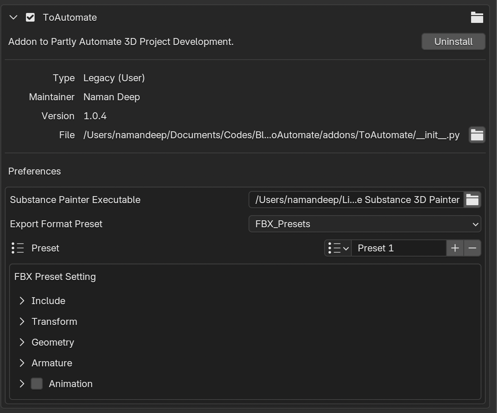

# Addon Preferences
Addon Preference menu for ToAutomate. 
 

## Preferences Settings

### Substance Painter Executable:
1. Select the Executable file for the "Substance Painter 3D".exe / .app (for mac)
    1. Used in Export Preset, if we want to open the exported file in a substance project.
    2. By Default: It should be auto-filled, if Substance painter is installed in default directories on users' computer.
    3. Otherwise Manually got the Substance Painter Directory and select the executable file. **`[.exe for Windows], [.app for MacOS]`**

### Export Type/Format Preset:
1. Select the type of Export Format to make it as default type when creating a new Preset.
2. Select/Create a Preset for Selected Format, Eg: Unity_FBX, Unreal_FBX etc. (This **active preset** of **active selected format_type** above will be set when creating new preset.)

3. **`Example:`**
    1. Let's say user selected Format Type:  **`USD`** in the preferences
    2. Now he create a preset for USD, let's name it `USD_Unity`. That is now active in the list.
    3. When a user now creates a new Export Preset in the Addon Panel (N-panel) of 3D viewport.
        1. The new preset created will have format as default **`USD`**, and settings for it will be copied from the active preset of that type, that is `USD_Unity`.

    **`Note`**: When you leave ToAutomate preferences after creating a preset, make sure, you check which values are selected for Format and Preset of that Format. They become default for new presets in the Addon menu.

4. Export Format Preset Settings:
    1. Menu to Change the Export Settings for each export preset.
    2. Implemented exactly as the blender's settings menu for each export format.