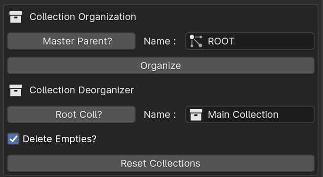

# Collection Organizer
Collection Organizer helps in organizing blender collection heirarchy and converts it into heirarchy of empty_parents, that is helpful for working/exporting objects to Unity and other empty_based heirarchy softwares.

### UI Overview
1. `Master Parent?`: Option to create an extra parent object over the final heirarchy.
2. `Name for Master`: By default `ROOT`, name for the top parent object. Needs `Master Parent` to be `ON`.
3. `Organize Button`: Button to convert current view_layers collection heirarchy and make their objects child of empty object of the collection they live in.

**Note:** 
All the empty objects will follow the heirarchy of the Collection tree of Blender Scene. So, if blender scene has multiple collection, instead of one base collection of tree.
That will lead to creation of 3-different heirarchy.
That's why there is an option to create an `Parent` object to make those 3 Empty object under one.

## Collection De-Organizer
Collection De-Organizer helps in deorganizing empty-object parent heirachy and converts them to Blender Collection system. You can choose to delete the empties after the heirarchy conversion or not.

### UI Overview
1. `Root Coll?`: Option to create an extra parent collection over the final collection heirarchy.
2. `Name for Parent Collection`: Name for the parent collection of the heirarcy, needs `Root Col` option to be enabled.
3. `Delete Empties`: Option to delete the empties after the conversion of empty-object heirarchy to Blender Collections.
4. `Reset Collections`: Button to deorganize the empty-object heirarchy and convert it to Blender Collection.

## How To Use